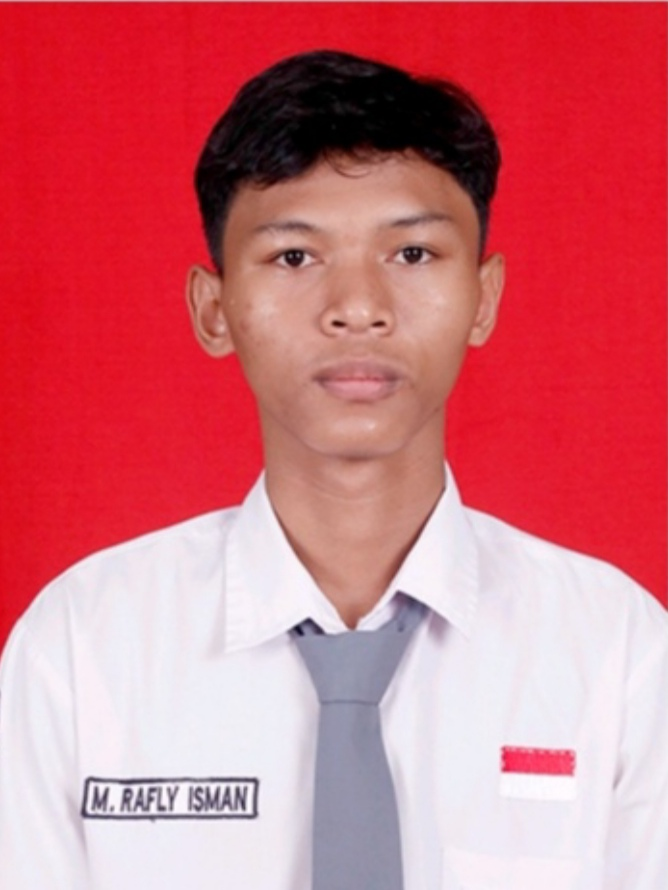
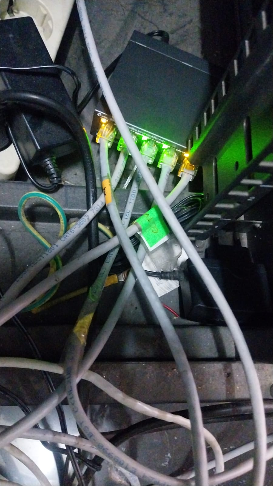
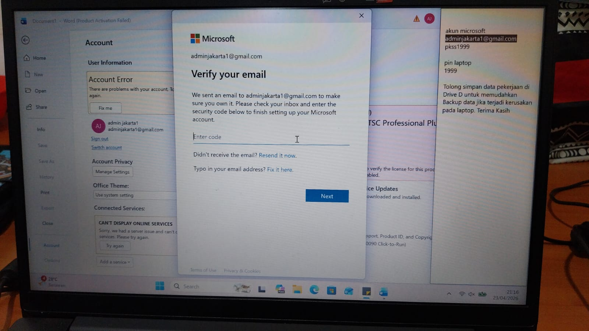
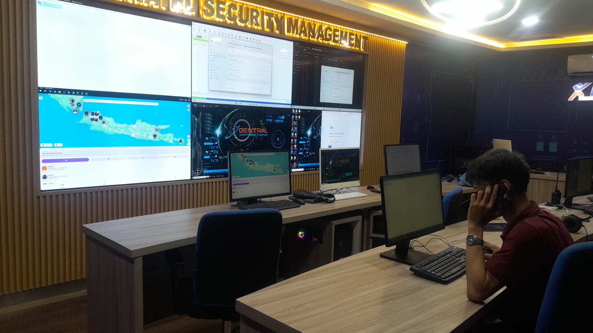

<!DOCTYPE html>
<html lang="id">
<head>
  <meta charset="UTF-8">
  <meta name="viewport" content="width=device-width, initial-scale=1.0">
  <title>CV Rafly Isman - Network Engineer</title>

  <link href="https://cdn.jsdelivr.net/npm/bootstrap@5.3.3/dist/css/bootstrap.min.css" rel="stylesheet">
  <link href="https://cdn.jsdelivr.net/npm/bootstrap-icons@1.11.3/font/bootstrap-icons.css" rel="stylesheet">

  
</head>

<body>

  <nav class="navbar navbar-expand-lg navbar-dark bg-primary fixed-top">
    

      <a class="navbar-brand fw-bold" href="#home">M Rafly Isman</a>

      <button class="navbar-toggler" type="button" data-bs-toggle="collapse" data-bs-target="#navbarNav">
        
      </button>

      

        <ul class="navbar-nav ms-auto">
          <li class="nav-item"><a class="nav-link" href="#about">Tentang</a></li>
          <li class="nav-item"><a class="nav-link" href="#skills">Keahlian</a></li>
          <li class="nav-item"><a class="nav-link" href="#education">Pendidikan</a></li>
          <li class="nav-item"><a class="nav-link" href="#projects">Project</a></li>
          <li class="nav-item"><a class="nav-link" href="#contact">Kontak</a></li>
        </ul>

        <button class="btn btn-light btn-sm ms-lg-3" onclick="toggleDarkMode()">
          <i class="bi bi-moon-stars"></i> Mode
        </button>
      

    

  </nav>

  <section id="home" class="hero">
    

      

        

          <h1 class="display-4 fw-bold">Muhammad Rafly Isman</h1>
          <h3 class="mb-3">Network Engineer</h3>
          

            Saya adalah mahasiswa Informatika yang memiliki minat besar pada bidang jaringan komputer,
            infrastruktur IT, dan keamanan jaringan.
          

          <a href="#contact" class="btn btn-warning btn-lg mt-3">Hubungi Saya</a>
          <a href="#projects" class="btn btn-outline-light btn-lg mt-3 ms-2">Lihat Project</a>
        

        

          
          
<small>Explore My Portfolio</small>

        

      

    

  </section>

  <section id="about" class="py-5">
    

      <h2 class="section-title">Tentang Saya</h2>

      

        

          Nama saya <strong>Muhammad Rafly Isman</strong>. Saya sedang menempuh pendidikan di bidang
          <b>Informatika</b> dan memiliki ketertarikan pada dunia <mark>Network Engineering</mark>.
          Saya suka mempelajari cara kerja jaringan komputer, konfigurasi perangkat jaringan,
          serta proses troubleshooting ketika terjadi gangguan koneksi.
        

        

          Dalam proses belajar, saya mulai memahami beberapa konsep seperti <em>TCP/IP</em>,
          <u>subnetting</u>, routing, switching, VLAN, dan penggunaan tools seperti Cisco Packet Tracer,
          MikroTik Winbox, serta Wireshark. Saya memiliki semangat belajar yang tinggi dan ingin terus
          mengembangkan kemampuan agar siap bekerja di bidang IT Support, NOC, maupun Junior Network Engineer.
        

      

    

  </section>

  <section id="skills" class="py-5 bg-light">
    

      <h2 class="section-title">Keahlian</h2>

      

        <h5>Hard Skills</h5>
        <ul>
          <li>Konfigurasi IP Address dan Subnetting</li>
          <li>Routing dan Switching Dasar</li>
          <li>Simulasi jaringan menggunakan Cisco Packet Tracer</li>
          <li>Troubleshooting jaringan komputer</li>
        </ul>

        <h5 class="mt-4">Soft Skills</h5>
        <ol>
          <li>Mampu bekerja sama dalam tim</li>
          <li>Memiliki kemampuan problem solving</li>
          <li>Disiplin dan bertanggung jawab</li>
          <li>Mudah beradaptasi dengan teknologi baru</li>
        </ol>

        

          MikroTik
          HTML
          C++
          IT Support
          Networking
          Linux
        

      

    

  </section>

  <section id="education" class="py-5">
    

      <h2 class="section-title">Pendidikan & Pengalaman</h2>

      

        

          

            <h4>Pendidikan</h4>

            <table class="table table-striped table-bordered mt-3">
              <thead class="table-primary">
                <tr>
                  <th>Tahun</th>
                  <th>Institusi</th>
                  <th>Jurusan</th>
                </tr>
              </thead>
              <tbody>
                <tr>
                  <td>2025 - Sekarang</td>
                  <td>Universitas Siber Asia</td>
                  <td>Informatika</td>
                </tr>
                <tr>
                  <td>2023 - 2025</td>
                  <td>SMK Trimulia Jakarta</td>
                  <td>Teknik Komputer dan Jaringan</td>
                </tr>
              </tbody>
            </table>
          

        

        

          

            <h4>Pengalaman / Pelatihan</h4>

            <table class="table table-hover table-bordered mt-3">
              <thead class="table-primary">
                <tr>
                  <th>Kegiatan</th>
                  <th>Keterangan</th>
                </tr>
              </thead>
              <tbody>
                <tr>
                  <td>Belajar Jaringan Komputer</td>
                  <td>Mempelajari dasar TCP/IP, subnetting, dan topologi jaringan.</td>
                </tr>
                <tr>
                  <td>Simulasi Cisco Packet Tracer</td>
                  <td>Membuat jaringan sederhana antar komputer, switch, dan router.</td>
                </tr>
                <tr>
                  <td>Belajar Web Dasar</td>
                  <td>Membuat website menggunakan HTML, CSS, JavaScript, dan Bootstrap.</td>
                </tr>
              </tbody>
            </table>
          

        

      

    

  </section>

  <section id="projects" class="py-5 bg-light">
    

      <h2 class="section-title">Project Saya</h2>

      

        

          

            
            

              <h5>Simulasi Jaringan Kantor</h5>
              
Membuat simulasi jaringan menggunakan router, switch, dan beberapa komputer.

            

          

        

        

          

            
            

              <h5>IT Support</h5>
              
Mengecek keluhan client agar kendala dapat diselesaikan secara langsung maupun remote.

            

          

        

        

          

            
            

              <h5>Monitoring Jaringan</h5>
              
Memantau jaringan secara real-time agar koneksi tetap stabil dan aman.

            

          

        

      

    

  </section>

  <section class="py-5">
    

      <h2 class="section-title">Link Penting</h2>

      

        
Berikut beberapa link yang berkaitan dengan pembelajaran dan portofolio saya:

        <a href="https://www.tiktok.com/@raflyisman19?is_from_webapp=1&sender_device=pc" target="_blank" class="btn btn-outline-primary m-1">TikTok</a>
        <a href="https://www.instagram.com/rflyisman?igsh=MXBpd2dhdW5ycWFjOA==" target="_blank" class="btn btn-outline-dark m-1">Instagram</a>
        <a href="https://www.linkedin.com/in/muhammad-rafly-isman-630b97362/" target="_blank" class="btn btn-outline-info m-1">LinkedIn</a>
      

    

  </section>

  <section id="contact" class="py-5 bg-light">
    

      <h2 class="section-title">Kontak</h2>

      

        

          

            <h4>Informasi Kontak</h4>
            
<i class="bi bi-envelope"></i> Email: raflyisman19@gmail.com

            
<i class="bi bi-telephone"></i> Telepon: 087849453748

            
<i class="bi bi-geo-alt"></i> Lokasi: Indonesia

          

        

        

          

            <h4>Kirim Pesan</h4>

            <form onsubmit="kirimPesan(event)">
              

                <label class="form-label">Nama</label>
                <input type="text" class="form-control" id="nama" required>
              

              

                <label class="form-label">Pesan</label>
                <textarea class="form-control" id="pesan" rows="3" required></textarea>
              

              <button type="submit" class="btn btn-primary">Kirim</button>
            </form>

            

          

        

      

    

  </section>

  <footer class="text-center">
    
&copy; Rafly Isman, Dibuat untuk tugas UTS Pemrograman Web I.

  </footer>

  

  

</body>
</html>
